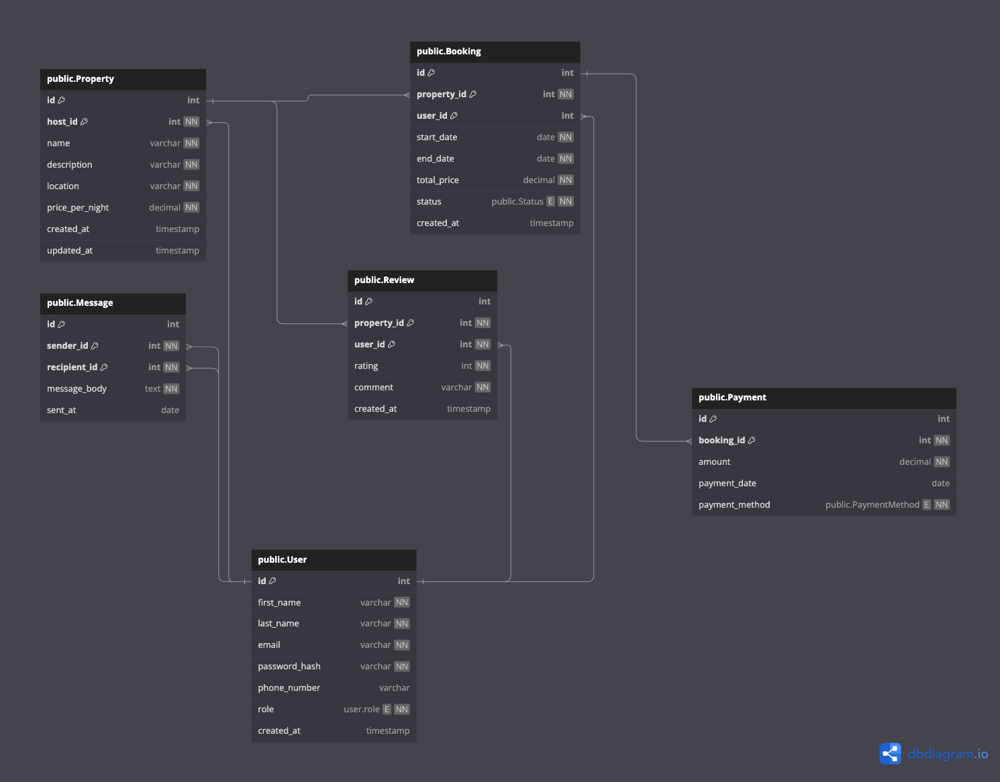

# Entities Definition
## User Entity - attributes

<table>

<tr>
<td>id </td><td> <code>int</code> </td> <td>[pk] </td>
</tr>
<tr>
<td> first_name </td> <td><code>varchar</code></td> <td>  [NOT NULL] </td>
</tr>
<tr>
<td> last_name </td> <td><code>varchar</code></td> <td>  [NOT NULL] </td>
<tr>
<td> email </td> <td><code>varchar</code></td> <td> [UNIQUE, NOT NULL] </td>
</tr>
<tr>
<td> password_hash </td> <td><code>varchar</code></td> <td> [NOT NULL] </td>
</tr>
<tr>
<td> phone_number </td> <td><code>varchar</code></td> <td>  [NULL] </td>
</tr>
<tr>
<td> role </td> <td><code>ENUM (guest, host, admin)</code></td> <td>  [NOT NULL] </td>
</tr>
<tr>
<td> created_at </td> <td><code>Timestamp</code></td> <td>  [def: CURRENT_TIMESTAMP] </td>
</tr>
</table>

# Property Entity
<table>

<tr>
<td>id </td><td> <code>int</code> </td> <td>[pk, UUID] </td>
</tr>
<tr>
<td> host_id </td> <td><code>int</code></td> <td> [fk, relationship: user.id] </td>
</tr>
<tr>
<td> name </td> <td><code>varchar</code></td> <td>  [NOT NULL] </td>
<tr>
<td> description </td> <td><code>text</code></td> <td> [NOT NULL] </td>
</tr>
<tr>
<td> location </td> <td><code>varchar</code></td> <td> [NOT NULL] </td>
</tr>
<tr>
<td> pricepernight </td> <td><code>decimal</code></td> <td>  [NOT NULL] </td>
</tr>
<tr>
<td> updated_at </td> <td><code>Timestamp</code></td> <td>  [def: CURRENT_TIMESTAMP] </td>
</tr>
<tr>
<td> created_at </td> <td><code>Timestamp</code></td> <td>  [def: CURRENT_TIMESTAMP] </td>
</tr>
</table>

# Booking Entity
<table>

<tr>
<td>id </td><td> <code>int</code> </td> <td>[pk, UUID] </td>
</tr>
<tr>
<td> property_id </td> <td><code>int</code></td> <td> [fk, ref: property.id, NOT NULL] </td>
</tr>
<tr>
<td> user_id </td> <td><code>int</code></td> <td>  [fk, ref: user.id, NOT NULL] </td>
<tr>
<td> start_date </td><td><code>date</code></td> <td> [NOT NULL] </td>
</tr>
<tr>
<td> end_date </td> <td><code>date</code></td> <td> [NOT NULL] </td>
</tr>
<tr>
<td> locked_pricepernight </td> <td><code>decimal</code></td> <td>  [NOT NULL] </td>
</tr>
<tr>
<td> status </td> <td><code>ENUM (pending, confirmed, canceled)</code></td> <td>[NOT NULL] </td>
</tr>
<tr>
<td> created_at </td> <td><code>Timestamp</code></td> <td>  [def: CURRENT_TIMESTAMP] </td>
</tr>
</table>

# Payment Entity
<table>

<tr>
<td>id </td><td> <code>int</code> </td> <td>[pk, UUID] </td>
</tr>
<tr>
<td> booking_id </td> <td><code>int</code></td> <td> [fk, ref: booking.id, NOT NULL] </td>
</tr>
<tr>
<td> amount </td> <td><code>decimal</code></td> <td>  [NOT NULL] </td>
<tr>
<td> payment_date </td><td><code>date</code></td> <td> [NOT NULL] </td>
</tr>
<tr>
<td> payment_method </td> <td><code>ENUM (credit_card, paypal, stripe)</code></td> <td>[NOT NULL] </td>
</tr>
<tr>
</table>

# Review Entity
<table>

<tr>
<td>id </td><td> <code>int</code> </td> <td>[pk, UUID] </td>
</tr>
<tr>
<td> property_id </td> <td><code>int</code></td> <td> [fk, ref: property.id, NOT NULL] </td>
</tr>
<tr>
<td> user_id </td> <td><code>int</code></td> <td> [fk, ref: user.id, NOT NULL] </td>
</tr>
<tr>
<td> rating </td><td><code>int</code></td> <td> [CHECK: rating >= 1 && rating =< 5, NOT NULL] </td>
</tr>
<tr>
<td> comment </td> <td><code>text</code></td> <td>[NOT NULL] </td>
</tr>
<tr>
<td> created_at </td> <td><code>Timestamp</code></td> <td>  [def: CURRENT_TIMESTAMP] </td>
</tr>
</table>

# Message Entity
<table>

<tr>
<td>id </td><td> <code>int</code> </td> <td>[pk, UUID] </td>
</tr>
<tr>
<td> sender_id </td> <td><code>int</code></td> <td> [fk, ref: user.id, NOT NULL] </td>
</tr>
<tr><tr>
<td> recipient_id </td> <td><code>int</code></td> <td> [fk, ref: user.id, NOT NULL] </td>
</tr>
<tr>
<td> message_body </td> <td><code>text</code></td> <td>[NOT NULL] </td>
</tr>
<tr>
<td> sent_at </td> <td><code>Date</code></td> <td>  [def: CURRENT_TIMESTAMP] </td>
</tr>
</table>

## Entity Constraints
<h4>User Entity</h4>
<pre>
* UNIQUE Fields - email
* Required fields - [not null]
</pre>
<h4> Property Entity</h4>
<pre>
* Foreign key - host_id
* Required fields - [not null]
</pre>

<h4> Booking Entity</h4>
<pre>
* Foreign key {Fk} - property_id, user_id
* Required fields - [not null]
* status (pending | confirmed | canceled)
</pre>

<h4> Payment Entity </h4>
<pre>
* Foreign key {fk} - booking_id
* Required fields - [not null]
</pre>

<h4>Review Entity</h4>
<pre>
* Foreign key {fk} - booking_id
* Required fields - [not null]
</pre>

<h4>Message Entity</h4>
<pre>
* Foreign key {fk} - sender_id, recipient_id
* Required fields - [not null]
</pre>

## Indexes

<pre>
* Primary keys PK 
* email, property_id, booking_id
</pre>

## ERD Diagram
